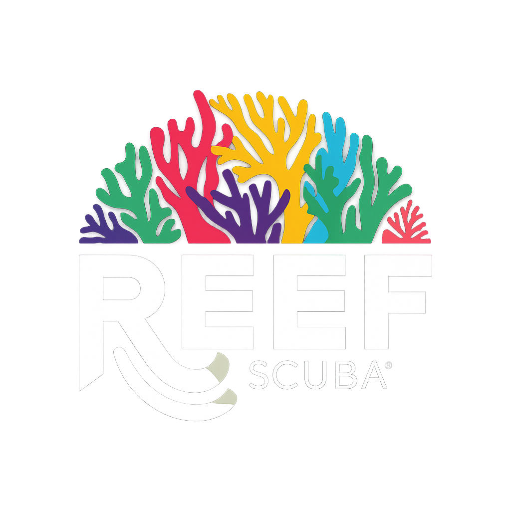

# Squarespace Deployment Checklist

## Before You Start
- [ ] Download the REEF SCUBA logo image
- [ ] Have access to your Squarespace site admin panel
- [ ] Have your complete coral spawning dataset ready

## Step 1: Prepare Your Data
- [ ] Copy your complete coral spawning data (6,178+ events)
- [ ] Copy your coral species/genus data (61 genera)
- [ ] Replace the sample data in `coral-spawning-app.js` with your actual data

## Step 2: Upload Files to Squarespace
- [ ] Go to Design → Custom CSS in your Squarespace admin
- [ ] Click "Manage Custom Files"
- [ ] Upload `coral-spawning-app.js` to Custom Files
- [ ] Note the generated URL (usually `/s/coral-spawning-app.js`)
- [ ] Upload `reef_scuba_logo.png` to Custom Files
- [ ] Note the generated URL (usually `/s/reef_scuba_logo.png`)

## Step 3: Create the Page
- [ ] Create a new page in Squarespace
- [ ] Set the page title (e.g., "Coral Spawning Database")
- [ ] Add a Code Block to the page
- [ ] Copy the entire contents of `index.html` into the code block

## Step 4: Update File Paths
- [ ] In the code block, find this line:
  ```html
  <script src="coral-spawning-app.js"></script>
  ```
- [ ] Replace with your Squarespace URL:
  ```html
  <script src="/s/coral-spawning-app.js"></script>
  ```
- [ ] Find this line:
  ```html
  
  ```
- [ ] Replace with your Squarespace URL:
  ```html
  
  ```

## Step 5: Test the Application
- [ ] Save and publish your page
- [ ] Visit the page and test basic functionality:
  - [ ] Map loads correctly
  - [ ] Location selection works
  - [ ] Search functionality works
  - [ ] Filters work properly
  - [ ] Export function works
  - [ ] Modal popups display correctly
  - [ ] Logo displays correctly

## Step 6: Mobile Testing
- [ ] Test on mobile devices
- [ ] Verify responsive layout works
- [ ] Check touch interactions on map
- [ ] Verify filters work on mobile

## Troubleshooting
If something doesn't work:
- [ ] Check browser console for JavaScript errors
- [ ] Verify file URLs are correct
- [ ] Ensure data syntax is valid JSON
- [ ] Test with sample data first

## Performance Notes
- Total file size is approximately 1.4MB (mostly the logo image)
- Application loads all data at once for fast searching
- Consider compressing the logo image if page load is slow

## Future Updates
To update data:
- [ ] Edit the data arrays in `coral-spawning-app.js`
- [ ] Re-upload the JavaScript file to Squarespace
- [ ] Changes take effect immediately

## Success Criteria
✅ Application loads without errors
✅ Map displays and responds to clicks
✅ Search returns results
✅ Filters work correctly
✅ Export generates CSV files
✅ Cards display with proper styling
✅ Modal details work
✅ Mobile responsive design works
✅ REEF SCUBA branding displays correctly

## Support
- Keep this checklist for future reference
- Document any customizations you make
- Save backups of your data files